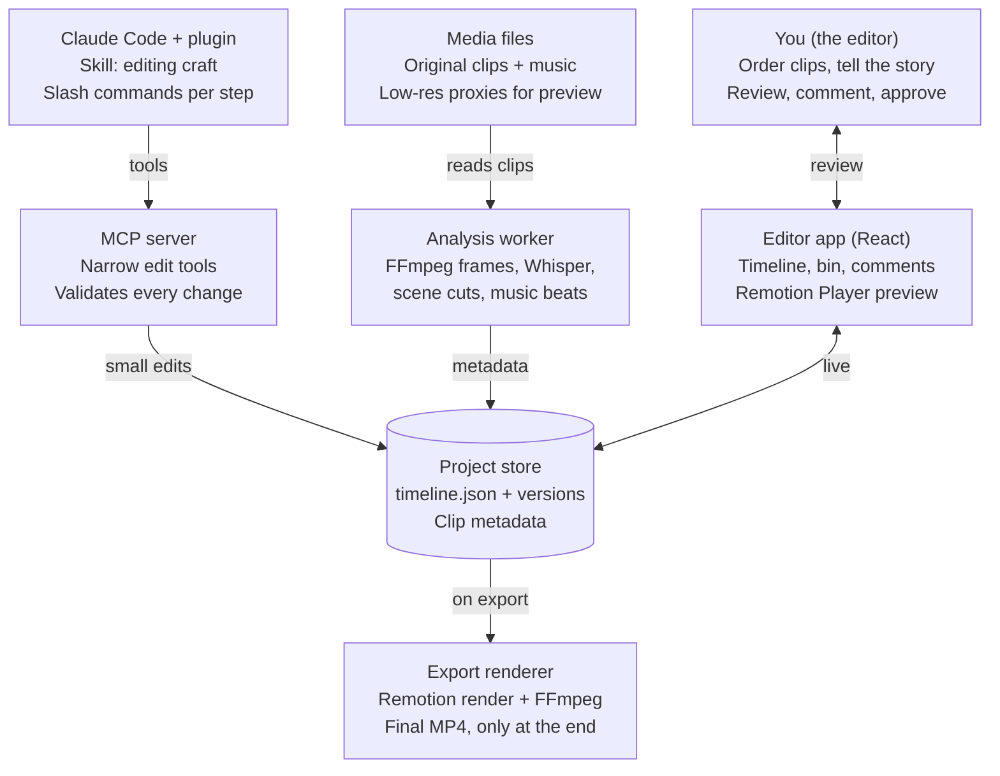
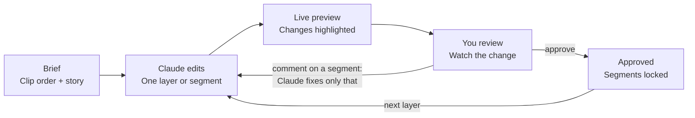

# AI Video Editor Plugin — Architecture

2026-09-28 · Prathmesh Gumal

## Overview

We build a React video editor plus a Claude plugin that turns a user's ordered clips and story notes into a finished short video, one small reviewable change at a time.

**Core principle: the timeline is data, not video.** The edit lives in a `timeline.json` file (clips, trims, transitions, captions, audio, graphics). Claude edits that file through narrow tools. The browser previews it live, and pixels are rendered only at export.

This fixes the main pain with AI-generated video: a small change no longer means regenerating and re-rendering the whole video. It becomes a one-field edit that previews in about a second.

**Goals**

- The user orders clips (for example, 20 day-in-my-life clips) and describes the story.
- Claude handles cuts, transitions, captions, music, J/L cuts and simple motion graphics.
- Every change is small, scoped to one segment or one layer, and reviewable before the next.
- Every version is saved and can be undone.

**Non-goals (v1):** generating realistic new footage, long-form video, multi-user collaboration.

## System components

Claude never touches video pixels. It changes the timeline through the MCP server, and the editor app shows the result right away.



| Component | Responsibility |
| --- | --- |
| Editor app | React UI: media bin, drag-and-drop timeline, live preview with the Remotion Player, comments pinned to segments |
| Project store | A local project folder: `timeline.json`, a snapshot per change, and clip metadata |
| MCP server | The only way Claude changes the edit. Each tool makes one small, validated change |
| Claude Code + plugin | Reads the story notes and metadata, plans the edit, calls tools. A skill teaches editing craft |
| Analysis worker | Runs once per clip: frames, transcript, shot changes, loudness, music beats |
| Export renderer | Renders the final MP4 from the timeline and the original (full-quality) clips |

## Timeline data model

`timeline.json` is the single source of truth. Every item has a stable `id`, so Claude and the user can talk about "segment `seg_07`" and change only that. Times are in frames (30 fps), which avoids rounding drift.

```json
{
  "version": 12,
  "settings": { "fps": 30, "width": 1080, "height": 1920 },
  "story": "Morning routine, commute, work, gym, evening with friends",
  "tracks": {
    "video": [
      { "id": "seg_07", "clip": "clip_03", "start": 240, "in": 45, "out": 180,
        "speed": 1.0, "transitionIn": { "type": "crossfade", "frames": 12 },
        "audioOffset": -18 }
    ],
    "audio": [
      { "id": "mus_01", "src": "music/lofi.mp3", "start": 0, "volume": 0.6,
        "duckUnderSpeech": true }
    ],
    "captions": [
      { "id": "cap_04", "start": 250, "end": 310, "text": "First coffee of the day",
        "style": "bold-pop" }
    ],
    "graphics": [
      { "id": "gfx_02", "component": "MapRoute", "start": 400, "frames": 90,
        "props": { "from": "Home", "to": "Office" } }
    ]
  },
  "locks": ["seg_01", "seg_02"]
}
```

- **J and L cuts** are just `audioOffset`: negative means the next clip's audio starts early (J cut), positive means the audio carries past the cut (L cut).
- **Motion graphics** are React components from a fixed library (`MapRoute`, `TitleCard`, `Counter`, `Scene3D`). Claude picks one and sets props. It writes a new component only when asked.
- **Locks** mark segments the user has approved. Tools refuse to change a locked item.
- A JSON Schema (for example with Zod) validates every write, so a bad edit is rejected before it reaches the preview.

## Clip analysis pipeline

Claude can read images and text but cannot watch video, so each clip is turned into text and thumbnails once, on import. Claude then plans from this metadata and never re-reads raw video.

| Step | Tool | Output | Used for |
| --- | --- | --- | --- |
| Probe | ffprobe | duration, fps, resolution, rotation | Timeline math, format checks |
| Proxy | FFmpeg | 540p H.264 copy | Smooth preview in the browser |
| Frames | FFmpeg | 1 JPEG per second + a contact sheet | Claude "sees" the clip |
| Transcript | Whisper | text with word-level timestamps | Captions, J/L cuts around speech |
| Shots | PySceneDetect | shot boundaries | Clean cut points |
| Loudness | FFmpeg `loudnorm` | LUFS per clip | Balancing audio levels |
| Beats | librosa | beat and downbeat times for music | Cutting on the beat |
| Summary | Claude | 1–2 line description + tags per clip | Fast planning without re-reading frames |

All outputs go to `metadata/<clip_id>.json`. The pipeline is cached by file hash, so re-importing is free.

## The Claude plugin

The plugin bundles three parts: an MCP server (what Claude can do), a skill (how a good editor thinks) and slash commands (the workflow steps).

**MCP tools.** Each one is narrow, validated, and writes a new timeline version.

| Group | Tools |
| --- | --- |
| Read | `list_clips`, `get_clip_metadata`, `get_frames(clip, times)`, `get_timeline`, `get_comments` |
| Structure | `reorder_segments`, `trim_segment`, `split_segment`, `remove_segment`, `set_speed` |
| Transitions | `set_transition(seg, type, frames)`, `set_audio_offset(seg, frames)` for J/L cuts |
| Text | `add_caption`, `update_caption`, `generate_captions(seg)` from the transcript |
| Audio | `set_music`, `snap_cuts_to_beats(range)`, `set_ducking`, `set_volume` |
| Graphics | `add_graphic(component, props)`, `update_graphic` |
| Review | `render_preview(seg)` to a short MP4 or frames, `snapshot_frame(time)` so Claude can check its own work |
| History | `list_versions`, `diff_versions`, `restore_version` |

**Skill: `video-editing`.** Rules and examples Claude follows:

- Hook the viewer in the first 3 seconds; cut dead air and repeated takes.
- Use J cuts to lead into speech and L cuts to let a moment breathe.
- Cut on action or on the beat; keep shots of a day-in-my-life video around 1–3 seconds.
- Keep captions inside the platform's safe zones; at most 2 lines, about 6 words each.
- Change only what was asked. Report what changed, as segment ids.

**Slash commands.** `/import` · `/rough-cut` · `/transitions` · `/captions` · `/music` · `/graphics` · `/fix <segment> <note>` · `/export`

## Interactive editing loop

Claude builds the video in layers, and the user approves each layer before the next starts. A comment on one segment changes only that segment.



**Layer order**

1. Rough cut: clip order, trims, removing dead air.
2. Transitions, plus J and L cuts.
3. Captions from the transcript.
4. Music: beat-synced cuts, ducking, loudness at about -14 LUFS.
5. Motion graphics and fillers such as title cards, maps and 3D text.
6. Export.

**Versioning**

- Every tool call saves a snapshot (`versions/v012.json`) with a one-line note of what changed.
- The UI highlights changed segments and supports undo, compare and restore.
- Comments are pinned to a segment id and a frame, and Claude reads them with `get_comments`.
- Locked (approved) segments can't be changed unless the user unlocks them.

## Tech stack and build plan

| Layer | Choice | Why |
| --- | --- | --- |
| Editor UI | React + Vite + TypeScript | Fast dev loop; shares types with the renderer |
| Preview and render | Remotion (`@remotion/player`, `@remotion/renderer`) | The video is a React component, so preview and export use the same code |
| 3D and motion | `@remotion/three`, react-three-fiber | 3D titles and scenes driven by the frame number |
| MCP server | TypeScript MCP SDK + Zod | Same timeline types as the UI; schema checks on every write |
| Analysis | Python: FFmpeg, faster-whisper, PySceneDetect, librosa | Mature, local, free |
| Storage | Project folder on disk (JSON + media) | Easy to inspect, back up and version with git |

**Build phases**

1. **MVP:** import clips, analysis, `timeline.json`, Remotion preview, and the rough cut (order and trims) through MCP tools.
2. **Captions and audio:** Whisper captions, music, beat snapping, ducking, loudness.
3. **Craft:** transitions, J/L cuts, segment comments, locks, version compare.
4. **Graphics:** a component library (title cards, maps, 3D text) and `add_graphic`.
5. **Export and polish:** full-quality render, platform presets (9:16, 16:9), safe-zone guides.

**Risks**

- **Claude's taste.** First cuts will be decent, not great. Mitigation: the skill's rules plus the review loop.
- **Visual understanding is sampled.** 1 frame per second can miss quick actions. Mitigation: `get_frames` at finer times when needed.
- **New footage.** Claude can make motion-graphic fillers, but not realistic video. That would need an external video-generation API.
- **Performance.** 4K phone clips are heavy. Mitigation: proxies for preview, originals only at export.
- **Licensing.** Remotion needs a paid company license above small-team size; music must be royalty-free.

**Open questions**

- Decided: v1 targets Reels and Shorts (9:16, 1080x1920); 16:9 comes later.
- Local-only desktop app, or a hosted web app with uploads?
- Where does music come from: the user's files or a royalty-free library?
