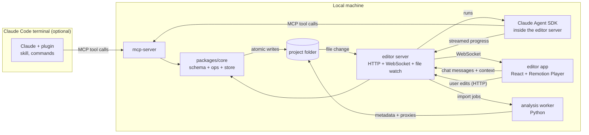

# claude-cut — Detailed Design (v1)

2026-09-28 · Prathmesh Gumal · Status: draft for review

This document turns [architecture.md](architecture.md) into a buildable design. It covers the repo layout, the timeline format, how edits are stored and synced, the analysis pipeline, the MCP tools Claude uses, the editor app, rendering, testing and milestones.

## 1. Decisions so far

| Topic | Decision | Notes |
| --- | --- | --- |
| Output format | 9:16 vertical, 1080×1920 | For Reels and Shorts. 16:9 comes later |
| Frame rate | 30 fps by default, 60 fps chosen when a project is created | Fixed for the life of a project |
| Export presets | 1080×1920 @ 30, 1080×1920 @ 60, 1440×2560 @ 60 | 2K/60 is for final export only |
| Where you give instructions | A chat panel inside the app; the editor server runs Claude through the Claude Agent SDK | See [section 12](#12-in-app-chat-claude-agent-sdk). Uses the same MCP tools |
| Claude Code terminal | Still supported through the plugin, for people who prefer it | Same tools, same rules |
| Claude billing (assumed) | Anthropic API key for the in-app chat | Check the Agent SDK docs for the current sign-in options |
| Where it runs (assumed) | On your own computer: the app runs in the browser at `localhost` | Media stays on disk; no uploads |
| Music (assumed) | Tracks you add yourself | A royalty-free library can come later |

Items marked "assumed" are proposals; see [Open questions](#19-open-questions).

## 2. Goals and non-goals

**Goals**

- Turn 10–30 short clips plus a written story into a 30–90 second vertical video.
- Every Claude change is small, has a name, and can be undone.
- You can review any change in the browser within about 1 second, with no rendering.
- You and Claude edit the same timeline, and neither silently overwrites the other.

**Non-goals for v1**

- Generating realistic new footage.
- Videos longer than about 3 minutes.
- More than one person editing at once, or cloud hosting.
- Color grading beyond a single project-wide look (LUT).

## 3. User workflow

1. **Create a project:** choose a name and frame rate. A project folder is created.
2. **Import clips:** drag clips into the media bin. Analysis runs in the background, and a progress bar shows for each clip.
3. **Arrange and brief:** drag clips into story order on the timeline and write the story in the Story panel.
4. **Rough cut:** click **Rough cut** in the chat panel (or type an instruction). Claude trims each clip and removes dead air while its progress streams into the chat, then summarizes what it did, listing segment ids.
5. **Review:** changed segments are highlighted. Play them, leave comments on specific segments, and approve (lock) the ones you like.
6. **Later layers:** **Transitions**, **Captions**, **Music** and **Graphics**, each followed by the same review.
7. **Fixes:** right-click a segment and choose **Ask Claude…**, or click **Fix my comments** so Claude handles your open comments and changes only those segments.
8. **Export:** the **Export** button writes the MP4 to `exports/`.

Everything above also works from the Claude Code terminal through the plugin's slash commands (section 11).

## 4. System overview



The key design choice: **all edits, whether made by Claude or by you, go through one shared library, `packages/core`.** It holds the schema, every edit operation and the only code that writes `timeline.json`. So both sides follow the same rules, and the MCP server keeps working even when the app is closed.

You normally talk to Claude in the app's chat panel: the editor server runs Claude through the Agent SDK, connected to the same MCP server. The Claude Code terminal is an optional second way in, using the same tools.

## 5. Repository layout

A pnpm monorepo, TypeScript everywhere except the analysis worker.

```
claude-cut/
├── packages/
│   ├── core/            # timeline schema (Zod), ops, store, validation — no UI, no I/O besides the store
│   └── composition/     # Remotion compositions: renders a timeline; used by both preview and export
├── apps/
│   ├── editor/          # Vite + React UI
│   └── server/          # local Node server: serves the UI and media, WebSocket, import and export jobs, Claude chat (Agent SDK)
├── mcp-server/          # MCP server exposing edit tools (stdio)
├── analysis/            # Python worker: ffmpeg, faster-whisper, PySceneDetect, librosa
├── prompts/
│   ├── editing-rules.md # the editing rules; shared by the in-app chat and the plugin's skill
│   └── actions/         # rough-cut.md, transitions.md, captions.md, music.md, graphics.md, fix.md
├── plugin/              # optional: the same features for the Claude Code terminal
│   ├── .claude-plugin/plugin.json
│   ├── .mcp.json        # starts mcp-server
│   ├── skills/video-editing/SKILL.md
│   └── commands/        # rough-cut.md, transitions.md, captions.md, music.md, graphics.md, fix.md, export.md
├── docs/
└── examples/sample-project/   # small test project with 5 short clips
```

## 6. Project folder on disk

```
my-day/
├── project.json          # name, fps, width, height, created, schemaVersion
├── timeline.json         # the current timeline (source of truth)
├── timeline.lock         # present only during a write
├── versions/
│   ├── v0001.json        # full snapshot per version
│   └── ...
├── changelog.jsonl       # one line per version: {version, author, note, ops, time}
├── comments.json         # comments pinned to segments
├── chat.json             # Agent SDK session id + chat history shown in the panel
├── media/
│   ├── originals/        # files as imported (never modified)
│   ├── normalized/       # constant-frame-rate copies used for editing and export
│   └── proxies/          # 540p copies used for preview
├── metadata/<clipId>.json
├── frames/<clipId>/      # 1 frame per second (JPEG, 512 px tall) + contact.jpg
├── music/
└── exports/
```

A snapshot per version is simple and makes undo safe. A 90-second timeline is about 20–50 KB, so 500 versions is only about 25 MB.

## 7. Timeline schema

All times are **integer frames** at the project's fps. The schema is defined once in `packages/core/schema.ts` with Zod, and TypeScript types are derived from it.

```ts
type Timeline = {
  schemaVersion: 1;
  version: number;                 // increments on every write
  settings: { fps: 30 | 60; width: 1080; height: 1920; lut?: string };
  story: string;                   // the user's brief
  video: VideoSegment[];           // ordered, back-to-back (no gaps in v1)
  audio: AudioItem[];              // music and sound effects
  captions: Caption[];
  graphics: Graphic[];             // overlays and fillers
  locks: string[];                 // ids of approved items
};

type VideoSegment = {
  id: string;                      // "seg_" + short id, never reused
  kind: "clip" | "filler";
  clipId?: string;                 // for kind "clip"
  graphicId?: string;              // for kind "filler" (a full-screen graphic)
  in: number; out: number;         // source frames, in < out
  speed: number;                   // 0.25–4
  audioOffset: number;             // J cut (<0) / L cut (>0), in frames
  clipVolume: number;              // 0–1
  transitionIn?: { type: "cut" | "crossfade" | "dip-black" | "slide" | "zoom" | "whip"; frames: number };
  crop?: { x: number; y: number; scale: number };   // reframing a 16:9 clip into 9:16
};

type AudioItem = { id: string; src: string; start: number; in: number; out: number;
                   volume: number; duckUnderSpeech: boolean; fadeIn: number; fadeOut: number };

type Caption = { id: string; start: number; end: number; text: string;
                 style: "clean" | "bold-pop" | "karaoke"; position: "lower" | "center" | "upper";
                 words?: { text: string; start: number; end: number }[] };

type Graphic = { id: string; component: GraphicName; start: number; frames: number;
                 props: Record<string, unknown> };
```

**Rules checked on every write**

- Every id is unique, and ids are never reused, so an id always points to the same thing in comments and in the changelog.
- Every segment has `in < out`, and its trimmed length fits inside the clip.
- A transition is no longer than half of either segment next to it.
- `|audioOffset|` is no more than the length of the segment next to it.
- Captions don't overlap, and each fits inside the video's length.
- Graphic `props` must match that component's own Zod schema.
- Items in `locks` can't be changed or removed unless they are unlocked first.

A segment's start time on the timeline isn't stored. It's worked out from the order of the segments and their lengths, which removes a whole class of errors where stored times disagree.

**Format changes:** `schemaVersion` plus migration functions in `packages/core/migrations/` upgrade old projects when they are opened.

## 8. Edits, versions and conflicts

### 8.1 Operations

Every change is an **operation**: a small JSON command such as `{ op: "trim", id: "seg_07", in: 45, out: 150 }`. `packages/core/ops.ts` has one pure function per operation, `(timeline, args) => timeline`, that throws a typed error when the change isn't allowed.

One write can contain several operations with one note. It's all-or-nothing: if any operation fails, nothing is saved. A rough cut is therefore one version, not 20.

### 8.2 Store

`store.apply(projectDir, { baseVersion, ops, author, note })`:

1. Takes `timeline.lock`, created exclusively. It retries for up to 2 seconds, then fails with `BUSY`.
2. Reads `timeline.json`. If `version !== baseVersion`, it fails with `CONFLICT` and returns the newer version.
3. Applies the operations and validates the result against the schema and rules.
4. Writes `versions/vNNNN.json`, then writes `timeline.json` through a temporary file and a rename, so the file is never half-written. Then it adds a line to `changelog.jsonl`.
5. Releases the lock and returns `{ version, changedIds }`.

### 8.3 Conflicts

If you drag a clip while Claude is editing, whichever write lands second gets `CONFLICT`. The app reloads and shows a notice. Claude's tools re-read the timeline and try again once, automatically, if the change doesn't touch the same ids; otherwise they report the conflict to Claude. No edit is ever silently lost.

### 8.4 Undo and compare

- **Undo** restores version N−1 by saving it as a **new** version, so history is never rewritten.
- **Compare** shows the ids that were added, removed or changed between two versions, and the app can play either one.

## 9. Import and analysis

The editor server runs import jobs one at a time per project and sends progress to the app over the WebSocket. Each step is cached by the file's SHA-256, so re-importing a file does nothing.

| Step | Command (simplified) | Output |
| --- | --- | --- |
| Probe | `ffprobe -show_streams -show_format -of json` | fps, duration, size, rotation, whether the frame rate is variable |
| Normalize | `ffmpeg -i in -vf fps=<projectFps>,scale=… -c:v libx264 -crf 18 -c:a aac -ar 48000` | `normalized/<id>.mp4` with a constant frame rate, correctly rotated |
| Proxy | `ffmpeg -i normalized -vf scale=-2:960 -c:v libx264 -crf 28 -g 15` | `proxies/<id>.mp4` (short keyframe interval so scrubbing is fast) |
| Frames | `ffmpeg -vf fps=1,scale=-2:512` + a 4×N contact sheet | `frames/<id>/*.jpg`, `contact.jpg` |
| Transcript | faster-whisper (`small` model, word timestamps) | words with start and end times |
| Shots | PySceneDetect (content detector) | shot boundaries |
| Loudness | `ffmpeg -af ebur128` | integrated LUFS, peak level |
| Beats (music only) | librosa `beat_track` | beat and downbeat times |
| Summary | Claude, through `describe_clip` on the contact sheet (optional) | 1–2 sentences + tags |

Converting to a constant frame rate is required, because phone footage usually has a variable frame rate, which makes frame-exact cuts drift.

**`metadata/<clipId>.json`**

```json
{
  "clipId": "clip_03", "file": "IMG_2041.MOV", "hash": "sha256:…",
  "fps": 30, "frames": 612, "width": 1080, "height": 1920, "hasAudio": true,
  "loudness": { "lufs": -19.4, "peak": -1.2 },
  "shots": [0, 214, 480],
  "speech": [{ "start": 30, "end": 150, "text": "Okay, first coffee of the day", "words": [ … ] }],
  "silences": [[0, 28], [151, 210]],
  "summary": "Pouring coffee in a sunny kitchen, speaking to camera.",
  "tags": ["kitchen", "coffee", "talking"]
}
```

## 10. MCP server

A stdio MCP server written with the TypeScript MCP SDK. It finds the project through the `CLAUDE_CUT_PROJECT` environment variable or the `open_project` tool.

### 10.1 Tools

**Read tools** (they never change anything)

| Tool | Returns |
| --- | --- |
| `open_project(path)` | project settings, clip count, current version |
| `list_clips()` | id, length, summary and tags per clip, with the transcript shortened |
| `get_clip(clipId)` | full metadata |
| `get_frames(clipId, frames[])` | up to 8 images (reuses existing frames or extracts new ones) |
| `get_timeline()` | the timeline plus the worked-out start time of each segment |
| `get_comments(status?)` | open comments with segment id, frame and text |
| `list_versions(limit)`, `diff_versions(a, b)` | history and changes |

**Edit tools** (each one creates exactly one version and needs a `note`)

| Tool | Main inputs |
| --- | --- |
| `apply_edits(baseVersion, ops[], note)` | Several operations at once, all-or-nothing |
| `insert_segment(clipId, in, out, afterId?)` | |
| `trim_segment(id, in, out)` · `split_segment(id, atFrame)` · `remove_segment(id)` | |
| `move_segment(id, afterId)` | |
| `set_speed(id, speed)` · `set_crop(id, crop)` | |
| `set_transition(id, type, frames)` | |
| `set_audio_offset(id, frames)` | J/L cuts |
| `add_caption(...)` · `update_caption(id, ...)` · `remove_caption(id)` | |
| `generate_captions(segmentIds?, style)` | from the transcript's word timings; at most 2 lines, about 32 characters per line |
| `set_music(src, start, in, out, volume)` · `set_ducking(id, on)` · `snap_cuts_to_beats(fromId, toId, tolerance)` | |
| `add_graphic(component, start, frames, props)` · `update_graphic(id, props)` | |
| `lock(ids)` · `unlock(ids)` | normally done by you in the app; Claude uses them only when asked |
| `restore_version(v)` | |
| `resolve_comment(id, reply)` | |

The single-change tools are thin wrappers around `apply_edits`. They exist because small, well-named tools are easier for Claude to use correctly.

**Checking its own work**

| Tool | Returns |
| --- | --- |
| `snapshot_frame(frame)` | a PNG of that frame of the edit, rendered by Remotion `renderStill` |
| `render_preview(fromId, toId)` | a 540p MP4 of that range, plus 4 sample frames as images |

### 10.2 Responses and errors

Successful edits return `{ version, changedIds, summary }`. Errors return a code and a message Claude can act on:

| Code | Meaning | What Claude should do |
| --- | --- | --- |
| `NOT_FOUND` | unknown id | call `get_timeline` again |
| `LOCKED` | the item is approved | leave it alone, or ask you |
| `INVALID` | a rule was broken (the message names the rule) | fix the values |
| `CONFLICT` | the timeline changed meanwhile | re-read, then try again |
| `BUSY` | another write is in progress | try again |

## 11. Editing rules, actions and the plugin

The editing rules and the actions (rough cut, captions, …) are written once in `prompts/` and used in two places: the in-app chat (section 12) and the Claude Code plugin. The plugin is optional; it gives the same features to anyone who prefers the terminal.

- **`plugin.json`**: name, version, description.
- **`.mcp.json`**: starts `node mcp-server/dist/index.js`.
- **Editing rules** (`prompts/editing-rules.md`, also shipped as the plugin's skill `video-editing`): when to use each tool, plus:
  - Open with the strongest moment. The first 3 seconds decide whether people keep watching.
  - Shots of 1–3 seconds for montage parts, and longer for talking parts.
  - Trim at pauses in speech (the `silences` in the metadata) and at shot changes.
  - Use a J cut (6–12 frames) when the next clip starts with speech, and an L cut to let a reaction play out.
  - Mostly hard cuts. Use at most one style of fancy transition per video, and only where the story changes.
  - Music around -20 LUFS under speech, -14 LUFS for the final mix.
  - Change only what you were asked to. End each step with a list of changed segment ids.
- **Actions**: each action file tells Claude what to read, which tools it may use, and to stop for review at the end. In the app each action is a button; in the terminal it's a slash command.

| App button | Terminal command | Does |
| --- | --- | --- |
| Rough cut | `/rough-cut` | Reads the story, `list_clips` and the current order; trims and removes dead air in one `apply_edits` |
| Transitions | `/transitions` | Adds transitions and J/L cuts only where they help; changes nothing else |
| Captions | `/captions [style]` | `generate_captions`, then fixes wording and line breaks |
| Music | `/music <file>` | Places the music, snaps cuts to the beat within 3 frames, turns on ducking |
| Graphics | `/graphics` | Suggests at most 3 graphics or fillers and waits for your OK before adding them |
| Fix my comments | `/fix` | Handles open comments one by one and resolves each with a reply |
| Export | `/export <preset>` | Calls the editor server's export endpoint |

## 12. In-app chat (Claude Agent SDK)

You give Claude instructions inside the editor. The editor server runs Claude with the **Claude Agent SDK** (`@anthropic-ai/claude-agent-sdk`), which is Claude Code packaged as a library: the same agent, tool calling and sessions, controlled from our code.

### 12.1 Flow

1. You type in the chat panel, click an action button, or right-click a segment and choose **Ask Claude…**.
2. The app sends `POST /api/chat` with `{ text, action?, context }`. `context` holds the selected segment ids, the current `version`, the playhead frame and the ids of any open comments.
3. The server starts an Agent SDK run with:
   - our MCP server (section 10), so Claude uses exactly the same checked tools;
   - `prompts/editing-rules.md` plus the action's file as instructions;
   - a short context block made from `context`, for example "The user selected seg_07 at frame 312; the timeline is at version 42";
   - permission for **our MCP tools only**: no shell and no file editing, so Claude can only change the video through the checked tools;
   - the project's saved session id, so the conversation continues across messages.
4. The server forwards the SDK's messages to the app over the WebSocket as `chat:event` messages (text, "calling trim_segment…", results, errors). Edits land through `packages/core` as usual, so the preview updates live.
5. When the run ends, the server saves the session id and the visible chat history to `chat.json`.

### 12.2 Behavior

- **One run at a time per project.** While Claude is working, the chat input shows a **Stop** button, and your manual edits still work (conflicts are handled as in section 8.3).
- **Stop** cancels the run. Edits already saved stay saved and can be undone as usual.
- **Every chat reply ends with the changed segment ids**, and they're clickable, so you jump straight to reviewing them.
- **Frames cost the most tokens**, so the rules tell Claude to use metadata and contact sheets first, and `get_frames` only when it needs a closer look.
- **Errors** (no API key, rate limit, network) appear in the chat with a clear message; nothing in the timeline changes.

### 12.3 Sign-in and cost

The Agent SDK normally uses an **Anthropic API key**, set in the app's settings and kept in the local server's environment, never sent to the browser. It is billed per use, separately from a Claude subscription. Check the Agent SDK documentation for the current sign-in options before building. The settings screen shows the token usage of the last run, so costs stay visible.

### 12.4 Fallback

If the Agent SDK turns out not to fit, the server can run the Claude Code command line in non-interactive mode (`claude -p … --output-format stream-json`) with the plugin enabled and forward its output to the chat panel. The app side stays the same.

## 13. Editor app

**Layout** (built for a laptop screen, at least 1280 px wide)

```
┌───────────────┬───────────────────────────────┬─────────────────┐
│ Media bin      │  Preview (9:16 Remotion Player) │ Claude / Story / │
│ clip cards     │  play, frame step, safe-zone     │ Comments /       │
│ with progress  │  guides on/off                   │ History tabs     │
│                │                                  │ (Claude: chat,   │
│                │                                  │ action buttons,  │
│                │                                  │ Stop)            │
├───────────────┴───────────────────────────────┴─────────────────┤
│ Timeline: video row · captions row · graphics row · music row    │
│ (waveform) · changed items highlighted · lock icons · playhead    │
└──────────────────────────────────────────────────────────────────┘
```

**How it works**

- State is kept with Zustand. The timeline comes from the server; the app never keeps its own copy.
- You make edits (drag, trim handles, delete, lock) through `POST /api/ops` with `baseVersion`. The server runs the same `packages/core` store.
- The server watches `timeline.json` and `comments.json` (with chokidar) and sends `timeline:updated {version, changedIds, author, note}` over the WebSocket. The app highlights `changedIds` for 10 seconds, or until you play them.
- The preview uses the same composition as export (`packages/composition`) with a `useProxies` flag.
- Comments: click a segment, press `C`, and type. The comment is saved with the segment id and the current frame.
- History tab: a list of the changelog. Click a version to play it; "Restore" restores it with `restore_version`.
- Claude tab: the chat (section 12). Claude's messages stream in; segment ids in its replies are links that select and play that segment. Right-clicking a segment on the timeline opens **Ask Claude…** with that segment already attached.

**Keyboard shortcuts:** space to play or pause, J/K/L for playback speed, ←/→ to move one frame, C to comment, L to lock, ⌘K to ask Claude about the selection, ⌘Z to undo (restores the previous version).

## 14. Rendering

- **One composition:** `packages/composition` turns a `Timeline` into Remotion layers: video segments, crossfades, graphics, captions and audio. The preview and the export use the same code, so what you see is what you get.
- **Audio:** each segment's audio is shifted by `audioOffset`. Ducking lowers the music volume by 12 dB, with a 6-frame fade, wherever there is speech (from the metadata `speech` ranges).
- **Export:** `@remotion/renderer` `renderMedia` with H.264, CRF 18, AAC at 48 kHz and 192 kb/s, from the `normalized/` media. Then a second pass with `ffmpeg loudnorm` to -14 LUFS integrated and -1 dBTP true peak.
- **Presets:** `1080p30`, `1080p60`, `1440p60`. 1440p scales the composition by 4/3; clips from the phone keep their native resolution when it's high enough.
- **Progress** is sent over the WebSocket, and the export can be cancelled.

## 15. Captions and motion graphics

**Caption safe zone for 9:16 (approximate):** keep text between 13% and 75% of the height, and at least 6% from the left and right edges, so the platform's buttons and profile name don't cover it. The preview can show these guides. The numbers are adjustable per platform preset.

**Styles in v1:** `clean` (white text with a subtle shadow), `bold-pop` (large text with a word-by-word pop-in), `karaoke` (the current word highlighted).

**Graphics library in v1.** Each is a React component with a Zod schema for its props:

| Component | Use | Main props |
| --- | --- | --- |
| `TitleCard` | opening title, chapter titles | text, subtitle, theme |
| `LowerThird` | naming a place or person | title, subtitle |
| `MapRoute` | "home → office" moments | from, to, style |
| `Counter` | "5 km run", "3 coffees" | from, to, suffix |
| `TimeStamp` | "7:00 AM" markers | time, label |
| `Text3D` | a 3D title, made with `@remotion/three` | text, color, motion |
| `EndCard` | the closing card | text, handle |

A **filler** segment is a graphic shown full-screen as its own segment, for example a "Later that day…" card.

## 16. Testing

| Level | What | How |
| --- | --- | --- |
| Unit | every operation and every rule in `packages/core` | Vitest; property tests (fast-check) that check random edit sequences always produce a valid timeline |
| Store | locking, conflicts, atomic writes | Vitest with two writers running at once against a temporary folder |
| MCP | tool inputs and outputs, error codes | tool-call tests against the MCP SDK's in-memory transport |
| Chat | request → Agent SDK run → WebSocket events; Stop; only our tools allowed | server tests with the Agent SDK replaced by a scripted fake; one real run against the sample project before each release |
| Analysis | expected metadata for `examples/sample-project` | pytest with tolerances (for example, shot boundaries within 2 frames) |
| Rendering | frames look as expected | render specific frames of a fixed timeline and compare images, allowing small differences |
| End to end | import → rough cut → export | a script that drives the MCP tools against the sample project and checks the MP4's length, fps, size and loudness |

## 17. Milestones

| # | Milestone | Done when |
| --- | --- | --- |
| M1 | Core and store | Schema, operations, store with locking and versions; unit and store tests pass |
| M2 | Import and analysis | Importing the sample project creates normalized copies, proxies, frames and metadata; re-importing is instant |
| M3 | Editor preview | The app shows the bin, timeline and live preview; drag, trim and lock work; outside changes to `timeline.json` appear within 1 second |
| M4 | MCP server and in-app chat | In the app, **Rough cut** on the sample project produces a reviewable version with progress streamed into the chat; **Ask Claude…** on one segment changes only that segment; **Fix my comments** resolves a comment; Stop works |
| M5 | Captions and music | Captions from the transcript, ducking, beat snapping |
| M6 | Transitions and graphics | The transitions list, J/L cuts, the 7 graphics components |
| M7 | Export | All 3 presets; the output measures -14 LUFS ±1; the end-to-end test passes |
| M8 | Terminal plugin | The same actions work as slash commands in Claude Code |

## 18. Risks

| Risk | Impact | Mitigation |
| --- | --- | --- |
| Remotion is slow when decoding many clips | Slow previews and exports | Proxies for preview; `OffthreadVideo`; Remotion Lambda later if needed |
| Claude's first cuts feel generic | Weak videos | Editing rules in `prompts/`; the story brief; review of each layer |
| API costs add up | Unexpected bill | Metadata and contact sheets before full frames; token usage shown after each run; a spending limit set on the API key |
| Agent SDK options change | Chat breaks after an update | Pin the SDK version; keep the command-line fallback (section 12.4) |
| Frames sampled once per second miss quick action | Bad cut points | `get_frames` at chosen frames; shot boundaries |
| You and Claude edit at the same time | Lost work | Version check + lock (section 8) |
| Remotion license | Cost if used by a company | Free for individuals and small teams; check before commercial use |
| Whisper is slow on CPU | Slow import | `small` model by default; `base` model option; import runs in the background |

## 19. Open questions

1. Is running on your own computer (the app at `localhost`) right for v1, or do you need a hosted web app with uploads?
2. Music: only tracks you add, or a royalty-free library too?
3. Should Claude be able to suggest a clip order itself, or does it always keep yours?
4. Do you want to support reframing 16:9 clips into 9:16 (the `crop` field) in v1, or can we assume all clips are vertical?
5. Which caption style should be the default?
6. Is an Anthropic API key for the in-app chat OK, or should Claude run on your subscription (which may mean keeping the terminal as the main way in)?
