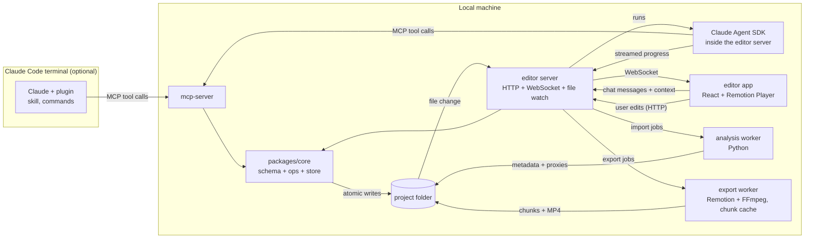

# claude-cut — Detailed Design (v1)

2026-09-28 · Prathmesh Gumal · Status: draft for review

This document turns [architecture.md](architecture.md) into a buildable design. It covers the repo layout, the timeline format, how edits are stored and synced, the analysis pipeline, the MCP tools Claude uses, the in-app chat, the editor app, music and sound, rendering, testing and milestones.

## 1. Decisions so far

| Topic | Decision | Notes |
| --- | --- | --- |
| Output format | 9:16 vertical, 1080×1920 | For Reels and Shorts. 16:9 comes later |
| Video length | Up to 10 minutes; designed and tested around 5 minutes | See the scale targets in section 2 |
| Frame rate | 30 fps by default; 24 fps (film look) or 60 fps chosen when a project is created | Fixed for the life of a project |
| Export presets | 1080×1920 @ 30, 1080×1920 @ 60, 1440×2560 @ 60 | 2K/60 is for final export only |
| Long videos | Split into chapters; Claude works one chapter at a time | Section 7 and 11 |
| Export | Rendered in chunks; only changed chunks are re-rendered | Section 15 |
| Where you give instructions | A chat panel inside the app; the editor server runs Claude through the Claude Agent SDK | See [section 12](#12-in-app-chat-claude-agent-sdk). Uses the same MCP tools |
| Claude Code terminal | Still supported through the plugin, for people who prefer it | Same tools, same rules |
| Claude billing (assumed) | Anthropic API key for the in-app chat | Check the Agent SDK docs for the current sign-in options |
| Where it runs (assumed) | On your own computer: the app runs in the browser at `localhost` | Media stays on disk; no uploads |
| Music (assumed) | Tracks you add yourself, plus a small bundled library of free sound effects | A licensed music library can come later; see section 14 |
| Quality bar | The edit analysed in [reference-analysis.md](reference-analysis.md): cuts on the beat, film-credit text, text behind people, one consistent look | Used as a test target |
| Aspect ratio support | The composition supports 9:16 and 16:9; 9:16 is the default | Whether 16:9 is also in v1 is open question 9 |
| Generated footage (optional) | You can connect video and image generation services with your own API keys; every generation needs your approval | Section 18 |

Items marked "assumed" are proposals; see [Open questions](#22-open-questions).

## 2. Goals and non-goals

**Goals**

- Turn your clips plus a written story into a vertical video of 30 seconds to 10 minutes.
- Every Claude change is small, has a name, and can be undone.
- You can review any change in the browser within about 1 second, with no rendering.
- You and Claude edit the same timeline, and neither silently overwrites the other.
- A small change to a finished video re-exports in about a minute, not by rendering everything again.

**Scale targets** (to be confirmed with measurements during M7)

| Measure | Target |
| --- | --- |
| Final video length | up to 10 min (optimized for about 5 min) |
| Segments on the timeline | up to 250 |
| Imported footage | up to about 60 min of source clips, up to 300 files |
| Preview after an edit | visible within 1 s |
| First full export, 5 min at 1080p30 | about 15 min or less on a recent laptop |
| Re-export after changing one caption or segment | about 1 min or less |

**Non-goals for v1**

- Claude generating footage itself. The video is made from your real clips; the app arranges them and adds text, graphics, music and sound on top. If you connect a generation service with your own API key, Claude can propose generated clips, which you approve one by one (section 18).
- Videos longer than 10 minutes.
- More than one person editing at once, or cloud hosting.
- Color grading beyond a single project-wide look (LUT).

## 3. User workflow

1. **Create a project:** choose a name and frame rate. A project folder is created.
2. **Import clips and music:** drag clips and songs into the media bin. Analysis runs in the background, and a progress bar shows for each file.
3. **Arrange and brief:** drag clips into story order on the timeline and write the story in the Story panel.
4. **Chapters:** Claude suggests chapters from your story and clip order ("Morning", "Commute", "Work", …). You adjust them. For a short video, one chapter is fine.
5. **Rough cut:** click **Rough cut** in the chat panel (or type an instruction). Claude works one chapter at a time: it trims each clip and removes dead air while its progress streams into the chat, then summarizes what it did, listing segment ids, and waits for your review before the next chapter.
6. **Review:** changed segments are highlighted. Play them, leave comments on specific segments, and approve (lock) the ones you like.
7. **Later layers:** **Transitions**, **Captions**, **Music** and **Graphics**, each followed by the same review. For music, Claude first proposes a plan (section 14) and waits for your OK.
8. **Fixes:** right-click a segment and choose **Ask Claude…**, or click **Fix my comments** so Claude handles your open comments and changes only those segments.
9. **Export:** the **Export** button writes the MP4 to `exports/`. Later exports re-render only what changed.

Everything above also works from the Claude Code terminal through the plugin's slash commands (section 11).

## 4. System overview



The key design choice: **all edits, whether made by Claude or by you, go through one shared library, `packages/core`.** It holds the schema, every edit operation and the only code that writes `timeline.json`. So both sides follow the same rules, and the MCP server keeps working even when the app is closed.

You normally talk to Claude in the app's chat panel: the editor server runs Claude through the Agent SDK, connected to the same MCP server. The Claude Code terminal is an optional second way in, using the same tools.

**What draws the picture:** the video frames always come from your real footage. Remotion (a React library for video) places each clip at the right time, blends clips during transitions, and draws only the extras on top: captions, titles, maps and other graphics.

## 5. Repository layout

A pnpm monorepo, TypeScript everywhere except the analysis worker.

```
claude-cut/
├── packages/
│   ├── core/            # timeline schema (Zod), ops, store, validation — no UI, no I/O besides the store
│   └── composition/     # Remotion compositions: renders a timeline; used by both preview and export
├── apps/
│   ├── editor/          # Vite + React UI
│   └── server/          # local Node server: UI and media, WebSocket, import and export jobs, Claude chat (Agent SDK)
│       └── providers/   # optional generation services (section 18), one adapter per service
├── mcp-server/          # MCP server exposing edit tools (stdio)
├── analysis/            # Python worker: ffmpeg, faster-whisper, PySceneDetect, librosa, person masks, shot report
├── assets/
│   ├── sfx/             # bundled sound effects with a free license (whoosh, pop, click, riser, …)
│   ├── luts/            # bundled looks (.cube files)
│   └── fonts/           # bundled fonts with an open license for titles and captions
├── prompts/
│   ├── editing-rules.md # the editing rules; shared by the in-app chat and the plugin's skill
│   └── actions/         # rough-cut.md, transitions.md, captions.md, music.md, graphics.md, fix.md
├── plugin/              # optional: the same features for the Claude Code terminal
│   ├── .claude-plugin/plugin.json
│   ├── .mcp.json        # starts mcp-server
│   ├── skills/video-editing/SKILL.md
│   └── commands/        # rough-cut.md, transitions.md, captions.md, music.md, graphics.md, fix.md, export.md
├── docs/
└── examples/
    ├── sample-project/  # small test project with 5 short clips and 1 song
    ├── long-project/    # generated 10-minute, 200-segment project for performance tests
    └── reference-edit/  # the 15 shots of the reference edit, when we have rights to use them (docs/reference-analysis.md)
```

## 6. Project folder on disk

```
my-day/
├── project.json          # name, fps, width, height, created, schemaVersion
├── timeline.json         # the current timeline (source of truth)
├── timeline.lock         # present only during a write
├── changelog.jsonl       # one line per version: {version, author, note, ops, time}
├── checkpoints/
│   ├── c0020.json        # full timeline every 20 versions
│   └── ...
├── comments.json         # comments pinned to segments
├── chat.json             # Agent SDK session id + chat history shown in the panel
├── media/
│   ├── originals/        # files as imported (never modified)
│   ├── normalized/       # constant-frame-rate copies used for editing and export
│   └── proxies/          # 540p copies used for preview
├── metadata/<clipId>.json
├── frames/<clipId>/      # 1 frame per second (JPEG, 512 px tall) + contact.jpg
├── masks/<segmentId>/    # person masks for "text behind people" (section 16.3)
├── generated/            # clips and images from generation services, with generated/<id>.json (prompt, service, cost)
├── music/                # songs you add, plus music/<trackId>.analysis.json
├── cache/chunks/         # rendered export chunks, named by their fingerprint (section 15)
└── exports/
```

**Disk use:** a 10-minute edit usually comes from 30–60 minutes of phone footage, which is several GB. Normalized copies roughly double that, and proxies add 10–20%. The app shows the project's disk use and can delete normalized copies and proxies, which can be rebuilt from the originals.

## 7. Timeline schema

All times are **integer frames** at the project's fps. The schema is defined once in `packages/core/schema.ts` with Zod, and TypeScript types are derived from it.

```ts
type Timeline = {
  schemaVersion: 1;
  version: number;                 // increments on every write
  settings: { fps: 24 | 30 | 60; aspect: "9:16" | "16:9"; look: Look };   // width/height follow from aspect + preset
  story: string;                   // the user's brief
  chapters: Chapter[];             // in order; every segment belongs to exactly one
  video: VideoSegment[];           // ordered, back-to-back (no gaps in v1)
  audio: AudioItem[];              // music, sound effects, ambience
  captions: Caption[];
  graphics: Graphic[];             // overlays and fillers
  markers: Marker[];               // hit points: moments the music should land on
  locks: string[];                 // ids of approved items
};

type Chapter = { id: string; title: string; note?: string };

type VideoSegment = {
  id: string;                      // "seg_" + short id, never reused
  chapterId: string;
  kind: "clip" | "filler";
  clipId?: string;                 // for kind "clip"
  graphicId?: string;              // for kind "filler" (a full-screen graphic)
  in: number; out: number;         // source frames, in < out
  speed: number;                   // 0.25–4
  audioOffset: number;             // J cut (<0) / L cut (>0), in frames
  clipVolume: number;              // 0–1
  natSound?: boolean;              // bring the clip's own sound up over the music (section 14)
  transitionIn?: { type: "cut" | "crossfade" | "dip-black" | "slide" | "zoom" | "whip"; frames: number };
  crop?: { x: number; y: number; scale: number };   // reframing, e.g. a 16:9 clip into 9:16
  pushIn?: { from: number; to: number };            // slow digital zoom across the segment (scale, e.g. 1.0 → 1.06)
  stabilize?: boolean;                              // use the stabilized copy of the clip (section 9)
  grade?: ClipGrade;                                // per-clip colour correction (section 17)
};

type Look = { lut?: string; lutStrength: number; grain: number; vignette: number };
type ClipGrade = { exposure: number; temperature: number; tint: number; saturation: number; contrast: number };

type AudioItem =
  | { id: string; role: "music"; trackId: string; start: number; in: number; out: number;
      volume: number; fadeIn: number; fadeOut: number;
      cuts: { from: number; to: number; crossfade: number }[];   // parts of the song removed, at bar lines
      duck: { enabled: boolean; depthDb: number; attack: number; release: number } }
  | { id: string; role: "sfx"; src: string; start: number; volume: number }
  | { id: string; role: "ambience"; src: string; start: number; frames: number; volume: number };

type Caption = { id: string; start: number; end: number; text: string;
                 style: "clean" | "bold-pop" | "karaoke"; position: "lower" | "center" | "upper";
                 words?: { text: string; start: number; end: number }[] };

type Graphic = { id: string; component: GraphicName; start: number; frames: number;
                 props: Record<string, unknown>;
                 position?: { x: number; y: number; anchor: "left" | "center" | "right" };  // 0–1 of the frame
                 behindSubject?: { segmentId: string };   // draw the segment's person mask over this graphic (section 16.3)
               };

type Marker = { id: string; frame: number; label: string; kind: "hit" | "note" };
```

**Rules checked on every write**

- Every id is unique, and ids are never reused, so an id always points to the same thing in comments and in the changelog.
- Every segment has `in < out`, and its trimmed length fits inside the clip.
- Every segment belongs to an existing chapter, and each chapter's segments are next to each other.
- A transition is no longer than half of either segment next to it.
- `|audioOffset|` is no more than the length of the segment next to it.
- Captions don't overlap, and each fits inside the video's length.
- Music `cuts` lie inside the song, don't overlap, and fall on the song's bar lines (from its analysis).
- Graphic `props` must match that component's own Zod schema, and `position` keeps the graphic inside the safe zone for the project's aspect ratio.
- `behindSubject` needs a finished mask for that segment, and the graphic must lie within the segment's time.
- Items in `locks` can't be changed or removed unless they are unlocked first.
- Total length is at most 10 minutes.

A segment's start time on the timeline isn't stored. It's worked out from the order of the segments and their lengths, which removes a whole class of errors where stored times disagree.

**Format changes:** `schemaVersion` plus migration functions in `packages/core/migrations/` upgrade old projects when they are opened.

## 8. Edits, versions and conflicts

### 8.1 Operations

Every change is an **operation**: a small JSON command such as `{ op: "trim", id: "seg_07", in: 45, out: 150 }`. `packages/core/ops.ts` has one pure function per operation, `(timeline, args) => timeline`, that throws a typed error when the change isn't allowed.

One write can contain several operations with one note. It's all-or-nothing: if any operation fails, nothing is saved. A chapter's rough cut is therefore one version, not 40.

### 8.2 Store

`store.apply(projectDir, { baseVersion, ops, author, note })`:

1. Takes `timeline.lock`, created exclusively. It retries for up to 2 seconds, then fails with `BUSY`.
2. Reads `timeline.json`. If `version !== baseVersion`, it fails with `CONFLICT` and returns the newer version.
3. Applies the operations and validates the result against the schema and rules.
4. Adds a line with the operations to `changelog.jsonl`. Every 20th version it also writes a full copy to `checkpoints/`. Then it writes `timeline.json` through a temporary file and a rename, so the file is never half-written.
5. Releases the lock and returns `{ version, changedIds }`.

A 10-minute timeline is about 200 KB, so a full copy per version would reach 100 MB after 500 edits. Storing operations plus a checkpoint every 20 versions keeps history small, and any version can still be rebuilt exactly: take the nearest earlier checkpoint and replay the operations after it.

### 8.3 Conflicts

If you drag a clip while Claude is editing, whichever write lands second gets `CONFLICT`. The app reloads and shows a notice. Claude's tools re-read the timeline and try again once, automatically, if the change doesn't touch the same ids; otherwise they report the conflict to Claude. No edit is ever silently lost.

### 8.4 Undo and compare

- **Undo** restores version N−1 by saving it as a **new** version, so history is never rewritten.
- **Compare** shows the ids that were added, removed or changed between two versions, and the app can play either one.

## 9. Import and analysis

The editor server runs import jobs one at a time per project and sends progress to the app over the WebSocket. Each step is cached by the file's SHA-256, so re-importing a file does nothing. With up to 60 minutes of footage, import can take a while, so clips become usable one by one as they finish.

**Video clips**

| Step | Command (simplified) | Output |
| --- | --- | --- |
| Probe | `ffprobe -show_streams -show_format -of json` | fps, duration, size, rotation, whether the frame rate is variable |
| Normalize | `ffmpeg -i in -vf fps=<projectFps>,scale=… -c:v libx264 -crf 18 -c:a aac -ar 48000` | `normalized/<id>.mp4` with a constant frame rate, correctly rotated |
| Proxy | `ffmpeg -i normalized -vf scale=-2:960 -c:v libx264 -crf 28 -g 15` | `proxies/<id>.mp4` (short keyframe interval so scrubbing is fast) |
| Frames | `ffmpeg -vf fps=1,scale=-2:512` + a 4×N contact sheet | `frames/<id>/*.jpg`, `contact.jpg` |
| Transcript | faster-whisper (`small` model, word timestamps) | words with start and end times |
| Shots | PySceneDetect (content detector) | shot boundaries |
| Loudness | `ffmpeg -af ebur128` | integrated LUFS, peak level |
| Summary | Claude, through `describe_clip` on the contact sheet (optional) | 1–2 sentences + tags |
| Shot report | camera-shake measure (FFmpeg `vidstabdetect`), exposure and colour-temperature estimate, sharpness | per clip: `steady` / `slightly shaky` / `shaky`, too dark / too bright, blurry; plus exposure and white-balance numbers used for colour matching (section 17) |
| Stabilized copy | FFmpeg `vidstabtransform` (only for clips marked shaky, or on request) | `normalized/<id>.stab.mp4`, used when a segment has `stabilize: true` |
| Placement map | per shot: a grid of how busy each area of the frame is (edge density + saliency) over a few sample frames | the calm areas where text can go; used to suggest title and caption positions (section 16.2) |

Converting to a constant frame rate is required, because phone footage usually has a variable frame rate, which makes frame-exact cuts drift.

**Shot report in the app:** clip cards show a small badge (steady, shaky, dark, blurry). Claude reads the report too: it prefers steady, well-exposed takes, suggests stabilizing shaky clips it wants to use, and tells you when a part of the story has no usable shot. Editing can't fully fix footage, so the report is how you find out early.

**Person masks** are not made on import, because they're slow. They are made on request for the few segments that use "text behind people" (section 16.3).

**Songs** (details in section 14.2)

| Step | Tool | Output |
| --- | --- | --- |
| Tempo, beats, bars | librosa beat tracking + a downbeat tracker, run for each of the top tempo candidates | 2–3 tempo candidates, each with beat and bar times; one marked as chosen (section 14.2) |
| Sections | librosa structure analysis (repeating parts) | approximate intro / verse / chorus / outro boundaries |
| Energy | loudness per beat | an energy curve: where the song builds, drops and calms down |
| Vocals | vocal-presence detection (optional source separation) | where the song has singing, which clashes with speech |
| Loudness | `ffmpeg -af ebur128` | integrated LUFS |

**`metadata/<clipId>.json`**

```json
{
  "clipId": "clip_03", "file": "IMG_2041.MOV", "hash": "sha256:…",
  "fps": 30, "frames": 612, "width": 1080, "height": 1920, "hasAudio": true,
  "loudness": { "lufs": -19.4, "peak": -1.2 },
  "shots": [0, 214, 480],
  "speech": [{ "start": 30, "end": 150, "text": "Okay, first coffee of the day", "words": [ … ] }],
  "silences": [[0, 28], [151, 210]],
  "summary": "Pouring coffee in a sunny kitchen, speaking to camera.",
  "tags": ["kitchen", "coffee", "talking"]
}
```

## 10. MCP server

A stdio MCP server written with the TypeScript MCP SDK. It finds the project through the `CLAUDE_CUT_PROJECT` environment variable or the `open_project` tool.

A 10-minute project can have 250 segments and an hour of transcripts, far too much to send to Claude at once. So read tools return **summaries by default and details on request**, and most of them take a chapter or a frame range.

### 10.1 Tools

**Read tools** (they never change anything)

| Tool | Returns |
| --- | --- |
| `open_project(path)` | project settings, clip count, chapter list, current version |
| `list_chapters()` | per chapter: title, segment count, length, what's approved |
| `list_clips(filter?)` | id, length, summary and tags per clip; filter by tag, chapter or "unused"; paged |
| `get_clip(clipId)` | full metadata, including the transcript |
| `get_frames(clipId, frames[])` | up to 8 images (reuses existing frames or extracts new ones) |
| `get_timeline({ chapterId } \| { fromFrame, toFrame } \| { overview: true })` | one chapter or range in full, with worked-out start times; `overview` gives one line per segment for the whole video |
| `get_music(trackId)` | tempo candidates, bars, sections, energy curve and vocal ranges of a song |
| `get_shot_report(clipId?)` | steadiness, exposure, sharpness per clip |
| `get_placement(segmentId)` | the calm areas of the shot, best first, as frame positions |
| `get_comments(status?)` | open comments with segment id, frame and text |
| `list_versions(limit)`, `diff_versions(a, b)` | history and changes |

**Edit tools** (each one creates exactly one version and needs a `note`)

| Tool | Main inputs |
| --- | --- |
| `apply_edits(baseVersion, ops[], note)` | Several operations at once, all-or-nothing |
| `set_chapters(chapters[])` · `move_to_chapter(segmentIds, chapterId)` | |
| `insert_segment(clipId, in, out, afterId?)` | |
| `trim_segment(id, in, out)` · `split_segment(id, atFrame)` · `remove_segment(id)` | |
| `move_segment(id, afterId)` | |
| `set_speed(id, speed)` · `set_crop(id, crop)` | |
| `set_transition(id, type, frames)` | |
| `set_audio_offset(id, frames)` | J/L cuts |
| `add_caption(...)` · `update_caption(id, ...)` · `remove_caption(id)` | |
| `generate_captions(chapterId \| segmentIds, style)` | from the transcript's word timings; at most 2 lines, about 32 characters per line |
| Music and sound | see section 14.5 |
| `add_graphic(component, start, frames, props, position?)` · `update_graphic(id, props, position?)` | |
| `add_credit_titles(segmentIds, credits[])` | one credit per segment, placed in each shot's calm area (section 16.2) |
| `request_mask(segmentId)` · `set_behind_subject(graphicId, on)` | text behind people (section 16.3) |
| `set_stabilize(segmentId, on)` · `set_push_in(segmentId, from, to)` | |
| `set_look(look)` · `set_grade(segmentId, grade)` · `match_colour(segmentIds, referenceSegmentId)` | section 17 |
| `propose_generation(...)` | section 18; creates a proposal you approve, never runs on its own |
| `lock(ids)` · `unlock(ids)` | normally done by you in the app; Claude uses them only when asked |
| `restore_version(v)` | |
| `resolve_comment(id, reply)` | |

The single-change tools are thin wrappers around `apply_edits`. They exist because small, well-named tools are easier for Claude to use correctly.

**Checking its own work**

| Tool | Returns |
| --- | --- |
| `snapshot_frame(frame)` | a PNG of that frame of the edit, rendered by Remotion `renderStill` |
| `render_preview(fromId, toId)` | a 540p MP4 of that range, plus 4 sample frames as images |

### 10.2 Responses and errors

Successful edits return `{ version, changedIds, summary }`. Errors return a code and a message Claude can act on:

| Code | Meaning | What Claude should do |
| --- | --- | --- |
| `NOT_FOUND` | unknown id | call `get_timeline` again |
| `LOCKED` | the item is approved | leave it alone, or ask you |
| `INVALID` | a rule was broken (the message names the rule) | fix the values |
| `CONFLICT` | the timeline changed meanwhile | re-read, then try again |
| `BUSY` | another write is in progress | try again |
| `TOO_LARGE` | the request would return too much | ask for one chapter or a smaller range |

## 11. Editing rules, actions and the plugin

The editing rules and the actions (rough cut, captions, …) are written once in `prompts/` and used in two places: the in-app chat (section 12) and the Claude Code plugin. The plugin is optional; it gives the same features to anyone who prefers the terminal.

- **`plugin.json`**: name, version, description.
- **`.mcp.json`**: starts `node mcp-server/dist/index.js`.
- **Editing rules** (`prompts/editing-rules.md`, also shipped as the plugin's skill `video-editing`): when to use each tool, plus:
  - Open with the strongest moment. The first 3 seconds decide whether people keep watching.
  - Shots of 1–3 seconds for montage parts, and longer for talking parts.
  - Trim at pauses in speech (the `silences` in the metadata) and at shot changes.
  - Use a J cut (6–12 frames) when the next clip starts with speech, and an L cut to let a reaction play out.
  - Mostly hard cuts. Use at most one style of fancy transition per video, and only where the story changes.
  - For longer videos, vary the pace: alternate montage parts with slower talking parts, and give each chapter a clear start.
  - Work on one chapter at a time. Read the overview first, then only the chapter you're editing.
  - Music rules are in section 14.
  - Change only what you were asked to. End each step with a list of changed segment ids.
- **Actions**: each action file tells Claude what to read, which tools it may use, and to stop for review at the end. An action runs on the selected chapter, or on each chapter in turn with a pause for review after each. In the app each action is a button; in the terminal it's a slash command.

| App button | Terminal command | Does |
| --- | --- | --- |
| Chapters | `/chapters` | Suggests chapters from the story and clip order |
| Rough cut | `/rough-cut` | Reads the story, the chapter's clips and the current order; trims and removes dead air in one `apply_edits` |
| Transitions | `/transitions` | Adds transitions and J/L cuts only where they help; changes nothing else |
| Captions | `/captions [style]` | `generate_captions`, then fixes wording and line breaks |
| Music | `/music` | Proposes a music plan, waits for your OK, then places, fits and mixes the music (section 14) |
| Graphics | `/graphics` | Suggests at most 3 graphics or fillers per chapter and waits for your OK before adding them |
| Fix my comments | `/fix` | Handles open comments one by one and resolves each with a reply |
| Export | `/export <preset>` | Calls the editor server's export endpoint |

## 12. In-app chat (Claude Agent SDK)

You give Claude instructions inside the editor. The editor server runs Claude with the **Claude Agent SDK** (`@anthropic-ai/claude-agent-sdk`), which is Claude Code packaged as a library: the same agent, tool calling and sessions, controlled from our code.

### 12.1 Flow

1. You type in the chat panel, click an action button, or right-click a segment and choose **Ask Claude…**.
2. The app sends `POST /api/chat` with `{ text, action?, context }`. `context` holds the selected chapter and segment ids, the current `version`, the playhead frame and the ids of any open comments.
3. The server starts an Agent SDK run with:
   - our MCP server (section 10), so Claude uses exactly the same checked tools;
   - `prompts/editing-rules.md` plus the action's file as instructions;
   - a short context block made from `context`, for example "The user selected seg_07 in chapter 'Morning' at frame 312; the timeline is at version 42";
   - permission for **our MCP tools only**: no shell and no file editing, so Claude can only change the video through the checked tools;
   - the project's saved session id, so the conversation continues across messages.
4. The server forwards the SDK's messages to the app over the WebSocket as `chat:event` messages (text, "calling trim_segment…", results, errors). Edits land through `packages/core` as usual, so the preview updates live.
5. When the run ends, the server saves the session id and the visible chat history to `chat.json`.

### 12.2 Behavior

- **One run at a time per project.** While Claude is working, the chat input shows a **Stop** button, and your manual edits still work (conflicts are handled as in section 8.3).
- **Stop** cancels the run. Edits already saved stay saved and can be undone as usual.
- **Every chat reply ends with the changed segment ids**, and they're clickable, so you jump straight to reviewing them.
- **Frames cost the most tokens**, so the rules tell Claude to use metadata and contact sheets first, and `get_frames` only when it needs a closer look.
- **Long conversations:** on a 10-minute project the chat can grow long. The Agent SDK manages its context; each action also starts from the overview and the current chapter, so it doesn't depend on old messages.
- **Errors** (no API key, rate limit, network) appear in the chat with a clear message; nothing in the timeline changes.

### 12.3 Sign-in and cost

The Agent SDK normally uses an **Anthropic API key**, set in the app's settings and kept in the local server's environment, never sent to the browser. It is billed per use, separately from a Claude subscription. Check the Agent SDK documentation for the current sign-in options before building. The settings screen shows the token usage of the last run, so costs stay visible.

### 12.4 Fallback

If the Agent SDK turns out not to fit, the server can run the Claude Code command line in non-interactive mode (`claude -p … --output-format stream-json`) with the plugin enabled and forward its output to the chat panel. The app side stays the same.

## 13. Editor app

**Layout** (built for a laptop screen, at least 1280 px wide)

```
┌───────────────┬───────────────────────────────┬─────────────────┐
│ Media bin      │  Preview (9:16 Remotion Player) │ Claude / Story / │
│ clips + songs  │  play, frame step, safe-zone     │ Comments /       │
│ with progress  │  guides on/off                   │ History tabs     │
│                │                                  │ (Claude: chat,   │
│                │                                  │ action buttons,  │
│                │                                  │ Stop)            │
├───────────────┴───────────────────────────────┴─────────────────┤
│ Mini-map of the whole video with chapter bands                   │
│ Timeline: video row · captions row · graphics row ·               │
│ music row (waveform, beat and bar ticks, song sections) ·         │
│ sfx row · markers · changed items highlighted · locks · playhead  │
└──────────────────────────────────────────────────────────────────┘
```

**How it works**

- State is kept with Zustand. The timeline comes from the server; the app never keeps its own copy.
- You make edits (drag, trim handles, delete, lock) through `POST /api/ops` with `baseVersion`. The server runs the same `packages/core` store.
- The server watches `timeline.json` and `comments.json` (with chokidar) and sends `timeline:updated {version, changedIds, author, note}` over the WebSocket. The app highlights `changedIds` for 10 seconds, or until you play them.
- The preview uses the same composition as export (`packages/composition`) with a `useProxies` flag. Only segments near the playhead load their video, so a 10-minute timeline plays as smoothly as a short one.
- **Long timelines:** the timeline zooms from the whole video down to single frames; a mini-map with chapter bands shows where you are; only the visible part of the timeline is drawn, so 250 segments stay fast. Clicking a chapter zooms to it.
- Comments: click a segment, press `C`, and type. The comment is saved with the segment id and the current frame.
- History tab: a list of the changelog. Click a version to play it; "Restore" restores it with `restore_version`.
- Claude tab: the chat (section 12). Claude's messages stream in; segment ids in its replies are links that select and play that segment. Right-clicking a segment on the timeline opens **Ask Claude…** with that segment already attached.

**Keyboard shortcuts:** space to play or pause, J/K/L for playback speed, ←/→ to move one frame, C to comment, L to lock, M to add a marker, ⌘K to ask Claude about the selection, ⌘Z to undo (restores the previous version).

## 14. Music and sound

Music does a lot of the storytelling in a day-in-my-life video: it sets the mood of each part of the day, drives the pace of montages, and makes key moments land. This section covers how songs are chosen, analysed, fitted to the edit, and mixed with speech and sound effects.

### 14.1 What Claude can and can't do with music

Claude can't listen to audio. It works from the analysis of each song (tempo, bars, sections, energy, vocals), the title and your description of its mood, and the edit's story and chapters. That is enough for the mechanical parts, like fitting a song to a chapter, cutting on the beat, ducking under speech and ending on the song's real ending. **Choosing the right song for a mood is your call**, or Claude suggests from your descriptions and tags, and you confirm by listening.

### 14.2 Song analysis

On import, each song gets `music/<trackId>.analysis.json`:

```json
{
  "trackId": "trk_02", "file": "sunny-morning.mp3", "durationFrames": 5400,
  "tempo": {
    "chosen": 0,
    "candidates": [
      { "bpm": 144, "confidence": 0.61, "beats": [11, 21, 31, …], "bars": [11, 51, 91, …] },
      { "bpm": 96,  "confidence": 0.58, "beats": [12, 27, 42, …], "bars": [12, 72, 132, …] }
    ]
  },
  "sections": [ { "label": "intro", "start": 0, "end": 690 },
                { "label": "A", "start": 690, "end": 2070 },
                { "label": "B", "start": 2070, "end": 3450, "energy": "high" } ],
  "energy": [0.21, 0.24, …],
  "vocals": [[700, 2000], [2100, 3400]],
  "lufs": -9.8,
  "userNotes": "calm, happy, acoustic"
}
```

Section labels are approximate (A, B, … for parts that repeat), not exact "verse" and "chorus".

**Tempo can be detected wrongly.** Beat detectors often lock onto the wrong pulse, such as two-thirds or half of the real tempo. On the reference edit, standard detection said 96 BPM, while every cut actually sat on a 144 BPM grid (see [reference-analysis.md](reference-analysis.md)). So:

- analysis keeps the top 2–3 tempo candidates, each with its own beat and bar grid;
- the music row on the timeline shows the chosen grid, and you can switch to another candidate or **tap the tempo** while the song plays;
- before snapping cuts, Claude checks the grid: if strong musical accents (onsets) keep falling between the grid's beats, it tells you and suggests the other candidate.

### 14.3 The music action

Music runs in small steps, like everything else:

1. **Plan (no edits yet).** Claude proposes a plan in the chat: which song for which chapters, which part of each song, where songs change, and 2–5 hit points: moments the music should land on, like a reveal, a jump into the pool or the first shot of the evening. You adjust it and approve.
2. **Place and fit.** For each song:
   - **Backtime:** line up the song's real ending with the end of its chapter or of the video, so the music ends properly instead of fading out in the middle.
   - **Shorten:** if the song is too long, remove whole bars or a repeated section (music `cuts`), joined with a short crossfade on a bar line so the edit can't be heard.
   - **Lengthen:** if it's too short, repeat a section on bar lines, or continue with a second song.
   - **Change songs:** a crossfade of 1–2 bars on a downbeat, or a hard stop on a cut, sometimes with a sound effect or a moment of silence.
3. **Cut to the music.** In montage parts, move cuts onto beats, within ±3 frames by default, using downbeats for bigger changes. Line up hit points with strong beats or with section changes (a drop, or a chorus starting). Talking parts are left alone: speech matters more than the beat.
   - **Rhythm patterns:** shot lengths are chosen in whole beats, and the pattern can build. The reference edit uses 8- and 6-beat shots, then 4-beat shots near the end so the energy rises, then holds the final shot. Claude can propose a pattern per chapter ("steady 8s", "build to 4s", "alternate 6 and 2").
4. **Mix.**
   - **Ducking:** lower the music under speech (12–18 dB by default), with a smooth attack and release, deeper when the song has vocals.
   - **Natural sound breaks:** for a laugh, a splash or a door slam, briefly bring up the clip's own sound over the music (`natSound`).
   - **Sound effects:** a small number of whooshes on transitions, pops on caption pop-ins, risers before a reveal. Used sparingly.
   - **Room tone and ambience:** fill tiny gaps so cuts in talking parts don't sound jumpy.
5. **Review.** Changed segments and audio items are highlighted as usual. You can lock the music once it feels right.

### 14.4 Levels

| Element | Target |
| --- | --- |
| Speech | the anchor of the mix; clear and even |
| Music under speech | 12–18 dB below speech |
| Music in montage parts (no speech) | full level, close to the final loudness |
| Sound effects | noticeable but never louder than speech |
| Final export | -14 LUFS integrated, -1 dBTP true peak (common for social platforms) |

### 14.5 Tools

| Tool | Main inputs | Does |
| --- | --- | --- |
| `get_music(trackId)` | | song analysis (read-only) |
| `set_music_tempo(trackId, candidate \| bpm + firstBeat)` | | picks another tempo candidate or a tapped tempo; beat and bar grids are recomputed |
| `place_music(trackId, start, in)` | | adds a song to the timeline |
| `fit_music(id, endFrame, method)` | method: `backtime`, `bar-cuts` or `fade` | makes the song end at `endFrame` |
| `set_music_cuts(id, cuts[])` | | removes or repeats bars by hand |
| `crossfade_music(fromId, toId, bars)` | | changes songs on a downbeat |
| `snap_cuts_to_beats(chapterId \| range, tolerance, prefer)` | prefer: `beat` or `downbeat` | moves nearby cuts onto the beat; skips locked and talking segments |
| `add_marker(frame, label)` · `align_to_marker(markerId, musicPoint)` | | hit points |
| `set_ducking(id, depthDb, attack, release)` | | |
| `set_nat_sound(segmentId, on)` | | |
| `add_sfx(name, frame, volume)` | name from `assets/sfx/` | |

### 14.6 Copyright

Commercial songs usually get the video muted, blocked or monetised by someone else on YouTube and Instagram. The app shows a warning when a song has no license note, and the docs recommend royalty-free or licensed music. A licensed library could be connected later (open question 2).

## 15. Rendering

- **One composition:** `packages/composition` turns a `Timeline` into Remotion layers: your real clips, transitions, graphics, captions and audio. The preview and the export use the same code, so what you see is what you get.
- **Presets:** `1080p30`, `1080p60`, `1440p60` (plus `1080p24` for 24 fps projects), in the project's aspect ratio: 1080×1920 or 1920×1080, and 1440×2560 or 2560×1440. 1440p scales the composition by 4/3; clips keep their native resolution when it's high enough.
- **Layers, bottom to top:** your clips (with correction, look and transitions), graphics and titles, the clip again cut out by a person mask where "text behind people" is used, captions, then grain and vignette.
- **Progress** is sent over the WebSocket, and the export can be cancelled.

### 15.1 Chunked export with a cache

A 10-minute video at 30 fps is 18,000 frames, and rendering every frame through the browser could take an hour. Re-rendering all of it after a small fix would bring back the original problem. So export works in chunks:

1. **Split** the video into chunks of about 10–20 seconds, always at hard cuts, never inside a transition.
2. **Fingerprint** each chunk: a hash of everything that affects it, meaning its segments, the captions, graphics and markers that overlap it, the settings, the preset and the composition code version.
3. **Reuse** any chunk whose fingerprint is already in `cache/chunks/`. Only new or changed chunks are rendered.
4. **Render** each chunk in the fastest way that is correct:
   - **Fast path:** a chunk of plain footage (cuts only, no text, graphics or effects) is cut and encoded directly with FFmpeg, roughly 10× faster.
   - **Remotion path:** anything else uses `renderMedia` with a `frameRange`.
   - Both paths use identical encoder settings (codec, profile, resolution, fps, pixel format, each chunk starting on a keyframe), so chunks join cleanly.
5. **Audio** is rendered once for the whole video, not per chunk, from the same composition (music, ducking, J/L cuts, sound effects), so there are no clicks where chunks meet. Audio is fast to render.
6. **Join** the video chunks with FFmpeg's concat, add the audio, and run `loudnorm` to -14 LUFS integrated and -1 dBTP true peak.

Chunks render in parallel, up to the number of CPU cores. Old chunks are cleaned up when the cache passes a size limit. If exports are still too slow, Remotion Lambda can render chunks in the cloud later.

## 16. Captions, titles and motion graphics

### 16.1 Captions

**Safe zones (approximate):** for 9:16, keep text between 13% and 75% of the height and at least 6% from the left and right edges, so the platform's buttons and profile name don't cover it. For 16:9, keep text inside the central 90% of the frame. The preview can show these guides, and the numbers are adjustable per platform preset.

**Styles in v1:** `clean` (white text with a subtle shadow), `bold-pop` (large text with a word-by-word pop-in), `karaoke` (the current word highlighted).

### 16.2 Credit titles and text placement

The reference edit's titles are a big part of its quality: a small, widely letter-spaced label above a bold name, placed in the calm part of each shot, appearing and disappearing with the cut.

**`CreditTitle` component**

| Prop | Meaning |
| --- | --- |
| `label` | the small line, e.g. "Directed by" (optional) |
| `name` | the main line, e.g. "Ninad Konde" |
| `style` | a named style: font, sizes, letter spacing, weight, colour, shadow; `film-credit` matches the reference |
| `enter` / `exit` | `cut` (default: appears and disappears with the shot), `fade` (6 frames) or `rise` (a small upward move) |
| `align` | left, centre or right, following where it's placed |

**Automatic placement**

1. The placement map from import (section 9) marks the calm areas of each shot: sky, road, walls, dark corners.
2. `add_credit_titles` places one title per segment in the best calm area that doesn't cover the main subject, inside the safe zone.
3. It varies the position from shot to shot (top-left, centre, bottom-right, …) so the sequence feels designed rather than stamped.
4. You can drag any title in the preview to move it; the new position is saved as an edit like any other.

The same placement map is used to keep captions and other graphics off faces and busy areas.

### 16.3 Text behind people

In the reference edit, a man walks in front of the word PEDESTRIANS. To do this:

1. **Mask:** `request_mask(segmentId)` runs a person-segmentation model on the frames of that segment, locally, and saves a greyscale mask video to `masks/<segmentId>/`. This is slow, roughly minutes for a few seconds of video on a laptop CPU and much faster with a GPU, so it runs only for segments that need it, in the background, with progress shown.
2. **Layers:** the composition draws the clip, then the text, then the clip again, cut out by the mask so only the person is visible. The person then appears in front of the text.
3. **Review:** the preview can show the mask edge. Hair, motion blur and fast movement can leave rough edges; if a shot doesn't look right, turn the effect off for it.

The segmentation model will be chosen when we build this. It must run locally and have a license that allows use in this app. v1 masks only people; other foreground objects can come later.

### 16.4 Graphics library

Each graphic is a React component with a Zod schema for its props. It is drawn on top of your footage, or shown full-screen as a filler:

| Component | Use | Main props |
| --- | --- | --- |
| `CreditTitle` | film-style credits, section 16.2 | label, name, style |
| `TitleCard` | opening title, chapter titles | text, subtitle, theme |
| `LowerThird` | naming a place or person | title, subtitle |
| `MapRoute` | "home → office" moments | from, to, style |
| `Counter` | "5 km run", "3 coffees" | from, to, suffix |
| `TimeStamp` | "7:00 AM" markers | time, label |
| `Text3D` | a 3D title, made with `@remotion/three` | text, color, motion |
| `EndCard` | the closing card | text, handle |

A **filler** segment is a graphic shown full-screen as its own segment, for example a "Later that day…" card.

## 17. Colour and look

Shots filmed at different times of day and with different settings look inconsistent when cut together. The reference edit has one warm, film-like look on every shot.

- **Project look** (`settings.look`): a LUT (a bundled look from `assets/luts/` or your own `.cube` file) with a strength setting, plus film grain and a vignette.
- **Per-clip correction** (`grade` on a segment): exposure, colour temperature, tint, saturation and contrast.
- **Colour matching:** `match_colour(segmentIds, referenceSegmentId)` uses the exposure and white-balance measurements from the shot report to bring the chosen shots close to a reference shot. Claude proposes it after the rough cut; you review it like any change.
- **Motion:** `set_push_in` adds a slow digital zoom that makes static shots feel alive; `set_stabilize` uses the stabilized copy of a shaky clip. Motion blur from a slow shutter can be imitated on chosen clips by blending neighbouring frames when the clip is prepared, but it looks best when filmed that way.
- **Frame rate:** 24 fps is offered for a film feel.

**How it's rendered:** the composition applies the correction and the LUT in a WebGL layer, so the preview and the export look the same. Export chunks that take the FFmpeg fast path (section 15.1) apply the same look with FFmpeg's colour filters (`lut3d` and colour adjustments). Rendering tests check that both paths match within a small tolerance; if they don't, that chunk uses the Remotion path.

## 18. Generated media (optional, with your own API keys)

Sometimes a video needs a shot you didn't film: an establishing shot of the city at dawn, a sky time-lapse, a stylised intro, or one more second of a shot to reach the next beat. You can connect **generation services** with your own API keys. Claude can then propose generated clips, and nothing is generated or paid for without your approval.

### 18.1 What it's for

| Use | Kind of service |
| --- | --- |
| B-roll you didn't film: scenery, weather, time-lapses, objects | text-to-video |
| Extending a shot by 1–2 seconds, or animating a still photo | image-to-video (from a frame of your clip, or a photo) |
| Backgrounds for title cards, stylised intro and outro | text-to-image, text-to-video |
| Sharper footage, or smooth slow motion | upscaling, frame interpolation |
| Narration, if you don't want to record it | text-to-speech |
| Music, if you don't have a track | music generation |

It is **not** for replacing your real moments. By default, Claude doesn't propose realistic footage of real, identifiable people, including you.

### 18.2 How it works

1. **Connect a service** in Settings: choose the service and enter its API key. Keys are stored locally (in the system keychain where available) and used only by the local server; they are never sent to the browser or to Claude. You set a spending limit per project.
2. **Proposal:** when Claude thinks a generated shot would help, it calls `propose_generation({ kind, prompt, referenceFrame?, seconds, aspect, purpose, placeAfter? })`. This only creates a proposal card in the chat, showing the prompt, the service, the length and the **estimated cost**.
3. **Your decision:** edit the prompt, approve or reject. You can also ask for a generated shot yourself ("add a 3-second sunrise over the city before the first shot").
4. **Generation:** the server sends the job to the service. Jobs can take minutes, so progress shows in the chat and you can keep editing.
5. **Import:** the result is saved to `generated/` with a record of the prompt, service, cost and date, then goes through the same import steps as your clips: normalizing, proxy, frames, shot report. It is colour-matched to the project's look.
6. **Placement:** it goes into the media bin marked as generated, and onto the timeline if the proposal said where. You review it like any other change. Trying again is a new proposal, because each attempt costs money.

**Service adapters:** each service gets a small adapter in `apps/server/providers/` with a common interface:

```ts
interface GenerationProvider {
  id: string; name: string;
  kinds: ("text-to-video" | "image-to-video" | "text-to-image" | "upscale" | "interpolate" | "voice" | "music")[];
  limits: { maxSeconds?: number; aspects?: string[] };
  estimate(req: GenerationRequest): Promise<{ costUsd?: number; seconds?: number }>;
  submit(req: GenerationRequest): Promise<string>;           // returns a job id
  status(jobId: string): Promise<"queued" | "running" | "done" | "failed">;
  download(jobId: string, dest: string): Promise<void>;
}
```

Video-generation services, their prices and their APIs change often, so no service is built in. The first adapters are chosen when we build this (open question 10), and adding another service means writing one adapter.

### 18.3 Rules

- Nothing is generated without your approval, and the estimated cost is always shown first. Generation stops at the project's spending limit.
- Generated clips are marked in the bin and on the timeline, and their record (prompt, service, cost) is kept with the project.
- Platforms increasingly require you to disclose realistic AI-generated content. When a video contains generated footage, the export dialog lists those clips and reminds you to check the platform's rules.
- Each service's own content rules and terms apply.

### 18.4 Limits

- Generated footage often doesn't match your camera's look, lens and lighting. It works best for short (2–5 s) establishing shots, transitions and stylised moments, colour-matched to the rest.
- People, hands and on-screen text in generated video often look wrong.
- Generation is slow and paid per second of output, so long generated sequences are expensive.

## 19. Testing

| Level | What | How |
| --- | --- | --- |
| Unit | every operation and every rule in `packages/core` | Vitest; property tests (fast-check) that check random edit sequences always produce a valid timeline |
| Store | locking, conflicts, atomic writes, rebuilding versions from checkpoints | Vitest with two writers running at once against a temporary folder |
| MCP | tool inputs and outputs, error codes, `TOO_LARGE` limits | tool-call tests against the MCP SDK's in-memory transport |
| Chat | request → Agent SDK run → WebSocket events; Stop; only our tools allowed | server tests with the Agent SDK replaced by a scripted fake; one real run against the sample project before each release |
| Analysis | expected metadata for the sample clips and song | pytest with tolerances (shot boundaries within 2 frames, beats within 2 frames, BPM within 1) |
| Tempo | the right tempo is among the candidates | a set of songs with known tempos, including the reference edit's song (144 BPM, not 96) |
| Music | fitting, bar cuts, beat snapping, ducking envelopes | unit tests on `packages/core` music ops; listening check of the sample project before each release |
| Rendering | frames look as expected; fast-path and Remotion chunks match, including colour | render specific frames of a fixed timeline and compare images, allowing small differences |
| Export cache | only changed chunks re-render; joins are seamless | change one caption in `long-project` and check that exactly one chunk re-renders and the output has no glitches at chunk edges |
| Performance | the scale targets in section 2 | `long-project` (10 min, 200 segments): preview responsiveness, full export time, re-export time |
| Generation | proposals, approval, cost limit, import of results | server tests with a fake provider; no real paid calls in automated tests |
| Reference edit | the quality bar | re-create the reference edit from its shots (when we have rights to use them) and compare cut timing, title placement and look |
| End to end | import → rough cut → music → export | a script that drives the MCP tools against the sample project and checks the MP4's length, fps, size and loudness |

## 20. Milestones

| # | Milestone | Done when |
| --- | --- | --- |
| M1 | Core and store | Schema (with chapters), operations, store with locking, changelog and checkpoints; unit and store tests pass |
| M2 | Import and analysis | Importing the sample project creates normalized copies, proxies, frames, metadata, shot report and placement maps, plus song analysis with tempo candidates; re-importing is instant |
| M3 | Editor preview | The app shows the bin, timeline with zoom and mini-map, and live preview; drag, trim and lock work; outside changes appear within 1 second; `long-project` plays smoothly |
| M4 | MCP server and in-app chat | In the app, **Chapters** and **Rough cut** on the sample project produce reviewable versions with progress streamed into the chat; **Ask Claude…** on one segment changes only that segment; **Fix my comments** resolves a comment; Stop works |
| M5 | Captions and credit titles | Captions from the transcript in 3 styles; `CreditTitle` with automatic placement; titles can be dragged |
| M6 | Music and sound | Music plan, tempo candidates and tap tempo, backtiming, bar cuts, beat snapping with rhythm patterns, ducking, natural sound breaks, sound effects |
| M7 | Look, transitions and graphics | Project look, per-clip correction and colour matching; stabilization and push-ins; the transitions list, J/L cuts, the graphics components |
| M8 | Text behind people | Masks on request; text drawn behind people; mask-edge preview |
| M9 | Export | All presets; chunk cache and fast path (with matching colour); the output measures -14 LUFS ±1; scale targets in section 2 met or re-agreed; the reference-edit test passes |
| M10 | Terminal plugin | The same actions work as slash commands in Claude Code |
| M11 | Generation services (optional) | One video-generation adapter; proposals with cost, approval, spending limit, import and colour matching of results |

## 21. Risks

| Risk | Impact | Mitigation |
| --- | --- | --- |
| Export of long videos is slow | Long waits | Chunk cache, FFmpeg fast path, parallel chunks; Remotion Lambda later if needed |
| Visible or audible glitches where chunks join | Broken output | Chunks split only at hard cuts; identical encoder settings; audio rendered in one piece; export-cache tests |
| Fast-path and Remotion colour don't match | Visible jumps in colour between chunks | Rendering tests compare both paths; fall back to the Remotion path when they differ |
| Remotion is slow when decoding many clips | Slow preview | Proxies; only segments near the playhead load; `OffthreadVideo` |
| Claude can't hear the music | Songs that don't fit the mood | You choose or confirm songs; Claude uses the analysis and your mood notes |
| Wrong tempo detected | Cuts off the beat | Several tempo candidates, a visible grid, tap tempo, and Claude checks the grid before snapping (section 14.2) |
| Masks have rough edges | "Text behind people" looks fake | Use only on chosen shots; mask-edge preview; easy to turn off per shot |
| Footage isn't cinematic | Well edited but not "film-like" | Shot report, stabilization, push-ins and colour matching; be clear that filming quality matters |
| Claude's first cuts feel generic | Weak videos | Editing rules in `prompts/`; the story brief; chapters; review of each layer; the reference edit as a test |
| Large projects overflow Claude's context | Confused or failed runs | Overview + one chapter at a time; `TOO_LARGE` errors instead of huge responses |
| API costs add up (Claude or generation services) | Unexpected bill | Summaries before details; frames only when needed; token usage shown after each run; generation needs approval with a cost estimate and a spending limit |
| Generated shots don't match the footage | Jarring clips | Keep them short; colour-match them; use them for establishing shots and transitions |
| Generation services change or shut down | Broken feature | One small adapter per service; nothing else depends on a specific service |
| Agent SDK options change | Chat breaks after an update | Pin the SDK version; keep the command-line fallback (section 12.4) |
| Frames sampled once per second miss quick action | Bad cut points | `get_frames` at chosen frames; shot boundaries |
| You and Claude edit at the same time | Lost work | Version check + lock (section 8) |
| Copyrighted music | Muted or blocked videos | Warning for songs without a license note; recommend licensed music |
| Remotion license | Cost if used by a company | Free for individuals and small teams; check before commercial use |
| Whisper and masks are slow on CPU | Slow import and effects | Smaller models by default; masks only on request; work runs in the background |
| Disk space | Projects of several GB | Show disk use; normalized copies, stabilized copies and proxies can be deleted and rebuilt |

## 22. Open questions

1. Is running on your own computer (the app at `localhost`) right for v1, or do you need a hosted web app with uploads?
2. Music: only tracks you add, or a licensed library too?
3. Should Claude be able to suggest a clip order itself, or does it always keep yours?
4. Do you want to support reframing 16:9 clips into 9:16 (the `crop` field) in v1, or can we assume all clips are vertical?
5. Which caption style should be the default?
6. Is an Anthropic API key for the in-app chat OK, or should Claude run on your subscription (which may mean keeping the terminal as the main way in)?
7. Do your videos mostly use instrumental music, or songs with vocals? Vocals under speech need deeper ducking and more careful placement.
8. Are the scale targets in section 2 right? For example, is a first full export of about 15 minutes for a 5-minute video acceptable?
9. The reference edit is 16:9. Should v1 support 16:9 as well as 9:16, and which should be the default?
10. Which generation services do you want to use first?
11. Can we use the reference edit's shots for testing (section 19)? We'd need the creator's permission.
